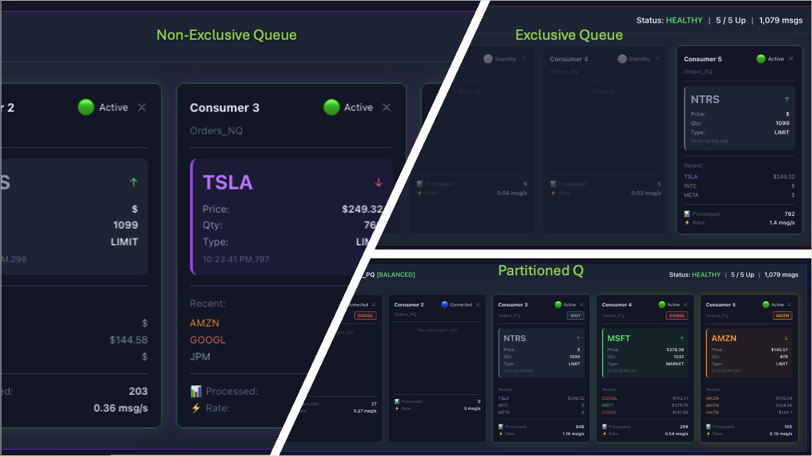
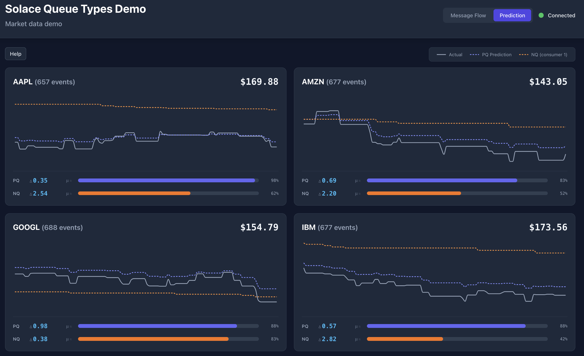
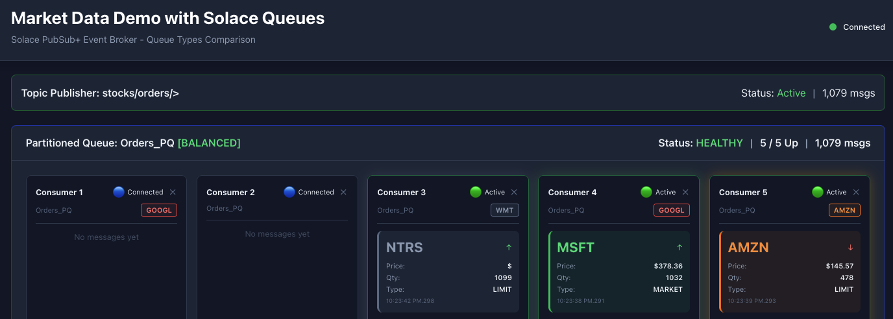

# Solace Queue Types — Interactive Demo

This is an **interactive demo** for Solace **PubSub+** queue types.

- A **publisher** emits stream of messages for a chosen scenario in a predefined **topic hierarchy**; **three** queues—a **partitioned**, a **non-exclusive**, and an **exclusive** queue—each subscribe to the same pattern, so every queue type sees the **same** traffic.
- **Consumers** attach to each queue, process messages, and publish live dashboard events to **`solace/catalog/`** topics; the browser subscribes over **Solace Web Transport** (`:8008`). Number of consumers per queue is configurable.
- The **dashboard** is a visual front end for that activity: you can see how each path delivers work, how load spreads, how ordering differs, and what happens when you **disconnect** or **reconnect** a consumer (**failover** on the exclusive one, **loadbalancing** on the non-exclusive queue, **rebalancing** on the partitioned queue).



## Profiles

**Profiles** pick the demo domain (e.g. market-style events for finance/banking; fulfillment-style events for retail). Profile defines the topic space, partition keys, payload fields, and on-screen labels. 

*Packaged profiles:*

- finance: `profiles/finance.json` — stock orders; **price** prediction by symbol
- retail: `profiles/retail.json` — fulfillment orders; **line total** prediction by store
- airline-carrier: `profiles/airline-carrier.json` — flight status; **delay (minutes)** prediction partitioned by **carrier** (IATA codes)
- airline-hub: `profiles/airline-hub.json` — same payload shape; **delay** prediction partitioned by **hub** (airport codes)

You can add more domains (energy, logistics, and so on) by copying those samples and staying within the rules enforced in `backend/lib/demoProfile.js`.

Profiles with **`ui.prediction`** show a **Prediction** tab: charts compare **actual** values from the publisher with lightweight EMA+VWAP estimates on the **partitioned** and **non-exclusive** consumer paths. Finance uses per-symbol **price**; retail uses **line total** by store; airline profiles use **delay (min)** by carrier or hub. See [Finance profile and the Prediction UI](#finance-profile-and-the-prediction-ui) for behavior and env vars.



## Getting started

### Prerequisites

- **Node.js** (v14+)
- **Docker and Docker Compose** (optional; for local full stack: broker, queue init, consumer, publisher, **static frontend on port 3000** — default profile **finance**)
- **Solace PubSub+** broker you can manage (create queues and topic subscriptions), unless you use the bundled Docker flow below

### 1. Start the Demo (Docker)

Full Docker guide: **[docs/README-Docker.md](docs/README-Docker.md)** (build, `demo.env`, operations, remote hosting, troubleshooting).

```bash
docker compose up -d --build
```

(`--build` recommended the first time or after changing Node dependencies.)

By default this starts the **bundled** **`solace-broker`** (PubSub+ Standard), a one-shot **`solace-init`** that provisions queues for every profile under `profiles/`, plus **consumer**, **publisher**, and **frontend** (**nginx** on **`http://localhost:3000`**). Shared settings live in **`demo.env`** (copy from **`demo.env.example`**).

For an **existing broker** (Solace Cloud, host install, remote VM) use apps only:

```bash
docker compose -f docker-compose.minimal.yml up -d --build
```

See **[docs/README-Docker.md](docs/README-Docker.md)** for compose layouts and `demo.env` per mode.

See **`scripts/setup-solace.sh`** if you need to change Solace resources.

To **re-run** provisioning (for example after adding a profile JSON or changing queue names in a profile):

```bash
docker compose run --rm solace-init
# or: docker compose up solace-init --force-recreate
```

Endpoints (typical local setup):

- **Dashboard (Docker frontend)**: http://localhost:3000 (Solace Web Transport to **`ws://localhost:8008`** — set **`SOLACE_PUBLIC_URL`** in **`demo.env`** and recreate **`demo-frontend`**)
- **PubSub+ Web Transport**: `ws://localhost:8008` (browser + Node apps)
- **PubSub+ Manager**: http://localhost:8080 (`admin` / `admin`)

The broker may take 30–60 seconds to become ready (logs show the broker is up, or Manager loads). **`solace-init`** polls SEMP until the VPN is available, then applies queue and subscription config.

Additional docker commands:

```bash
Check process:
docker compose ps

Check logs:
docker compose logs -f solace-broker
docker compose logs solace-init
docker compose logs -f consumer
docker compose logs -f publisher
docker compose logs -f frontend

Stop:
docker compose down

Remove volumes:
docker compose down -v
```

#### Profile (Docker) and UI

**Switch profile** — use the dashboard profile picker (all **`profiles/*.json`** are loaded by the consumer). No env change or container restart is required for the UI.

Re-run **`solace-init`** only when you **add or change profile JSON** (new queue names or partition counts):

```bash
docker compose run --rm solace-init
# or: docker compose up -d --force-recreate solace-init consumer publisher
```

**`solace-init`** is a **one-shot** container (`restart: "no"`). Compose does not re-run it after a successful exit until you recreate it.

With **`docker compose up`**, open the dashboard at **`http://localhost:3000`**. The frontend container regenerates **`/config.js`** from **`demo.env`** (and Compose defaults) at startup.

**Remote browsers (e.g. Azure VM public IP):** set **`SOLACE_PUBLIC_URL=ws://<VM_IP>:8008`** in **`demo.env`**, then **`docker compose up -d --force-recreate frontend`**. If **`solaceUrl`** is **`null`** in generated config, the app rewrites **`ws://localhost:8008`** to **`ws://<same host as the page>:8008`** when the page is not on localhost.

For **local Vite dev** (hot reload), run **`npm run consumer`**, **`npm run publisher`**, and **`npm run frontend`** (`prefrontend` runs **`npm run sync-config`** from **`demo.env`**).

**Start/stop apps independently** — use container names, for example:

```bash
docker stop demo-frontend && docker start demo-frontend
docker stop demo-publisher && docker start demo-publisher
docker stop demo-consumer && docker start demo-consumer   # catalog events stop while stopped
```

**Broker and init only** (no Node containers):  
`docker compose up -d solace-broker solace-init`

### 2. Install dependencies

```bash
npm run install-all

Or:
npm install && cd frontend && npm install && cd ..
```

### 3. Configure environment

Copy the template and edit **`demo.env`** in the **repository root** (see [Environment variables](#environment-variables)):

```bash
cp demo.env.example demo.env
```

If you already use **`solace.env`** from an older checkout, rename it to **`demo.env`** (same contents).

Regenerate the browser runtime config after edits:

```bash
npm run sync-config
```

**`demo.env`** is the single source of truth for Solace connection, publish rate, and dashboard settings. **`frontend/public/config.js`** is auto-generated — do not edit by hand. See [`.dev/pm/impl-central-config.md`](.dev/pm/impl-central-config.md).

Example (local host):

```env
SOLACE_HOST=ws://localhost:8008
SOLACE_VPN=default
SOLACE_USERNAME=default
SOLACE_PASSWORD=default
PUBLISH_RATE=10
NQ_PREDICTION_CONSUMER=1
```

**Docker Compose** uses the same **`demo.env`** file. The default **`docker compose up`** enables the bundled broker (`cp compose.env.example .env`); **`docker-compose.yml`** sets **`SOLACE_HOST=ws://solace-broker:8008`** for Node containers. For an external broker use **`docker compose -f docker-compose.minimal.yml`**. Set **`SOLACE_PUBLIC_URL`** in **`demo.env`** for remote browsers (e.g. `ws://<VM-IP>:8008`).

**Topic subscriptions on the broker** must cover traffic your profiles publish. With **Docker**, **`solace-init`** provisions queues and **`solace/demo/>`** (or profile-specific prefixes). On a **broker you manage yourself**, subscribe each queue to **`{messaging.topicPrefix}/>`** from the profile JSON (or a broader wildcard such as **`solace/demo/>`**).

### Choosing a profile

All **`profiles/*.json`** files load automatically. Pick a profile in the dashboard header (no restart). Queue names and partition keys live in each profile JSON. Partition count on the broker must match **`messaging.partitionKeys.length`** for that profile.

Profiles with **`features.prediction`** show the **Prediction** tab (see `backend/lib/demoProfile.js` for field constraints).

Solace **connection**, **VPN**, **credentials**, and **PUBLISH_RATE** stay in **`demo.env`**; profiles do not contain secrets.

### 4. Create queues on the broker

**Using Docker (step 1)** — Queues and subscriptions are created by **`solace-init`** for every file under **`profiles/`** (queue names come from each profile’s **`queues`** block).

**Manual or external broker** — Create queues named in your profile JSON (e.g. finance):

| Queue name | Queue type | Partition count | Partition key property | Topic subscription |
|------------|------------|-----------------|------------------------|--------------------|
| `Finance_PQ` (per profile) | Partitioned | Same as `partitionKeys.length` in that profile | `JMSXGroupID` | `{topicPrefix}/>` or `solace/demo/>` |
| `Finance_NQ` | Non-exclusive | — | — | same |
| `Finance_EQ` | Exclusive | — | — | same |

### 5. Run the app

The **consumer** process (15 queue consumers + catalog topic publisher) must run in addition to the publisher and frontend.


```bash
# Terminal 1: consumers + solace/catalog topics
npm run consumer

# Terminal 2: publisher + Vite (sync-config runs automatically)
npm run dev

# Or run all components separately:
npm run consumer
npm run publisher
npm run frontend
```

Then open **http://localhost:3000** (Vite port in `frontend/vite.config.js`).

### Using the dashboard

URL: **http://localhost:3000**.



**Header** — Solace connection indicator; primary title plus **profile subtitle** from `branding.appTitle` once **`solace/catalog/profiles`** (or initial **`state`** on the events topic) loads. If the profile sets `features.pricePrediction: true` (e.g. `profiles/finance.json`), tabs appear: **Message Flow** (consumer cards) and **Prediction** (price charts). The browser tab title follows `branding.documentTitle` when the profile loads.

**Publisher panel** — total published **events**, topic prefix (from profile or last publisher stats), and **Active** / **Inactive** based on whether **`publisherStats`** arrive on **`solace/catalog/stats/{profileId}/publisher`** (publisher process must be running for Active).

**Queue panels** (one per queue type)

- **Queue name** from the active profile JSON, not hardcoded in the UI  
- **Operational status** — HEALTHY, DEGRADED, or DOWN (plus UNKNOWN while warming up)  
- **Connected consumers** — count of connected / active / standby vs total (5 per queue type in this demo)  
- **Partitioned queue only** — broker partition state in brackets: BALANCED, REBALANCING, or UNKNOWN  

**Consumer tiles** (5 per queue)

- Status: active, connected, standby (exclusive), offline  
- Stats, recent messages, assigned partition key (partitioned queue)  
- Disconnect / reconnect for failover and rebalancing experiments  

**Prediction view** (details in [Finance profile and the Prediction UI](#finance-profile-and-the-prediction-ui); finance-style profiles only)

- Requires **`npm run publisher`** so actual prices and stats flow to the UI  
- Charts **actual** publisher prices vs **partitioned-queue** and **non-exclusive** consumer-side predictions (NQ chart uses one canonical consumer index; keep backend **`NQ_PREDICTION_CONSUMER`** and frontend **`VITE_NQ_PREDICTION_CONSUMER`** aligned — see `demo.env.example`)

**Quick experiments**

1. **Partitioned** — same partition key maps to one partition; disconnect a consumer and watch rebalancing.  
2. **Non-exclusive** — all consumers active; parallel delivery.  
3. **Exclusive** — one active, others standby; fail over by disconnecting the active consumer.  
4. **Rebalancing** — on the partitioned panel, disconnect a consumer, observe REBALANCING then BALANCED (~5s stabilization), then reconnect.  
5. **Prediction** — with `finance.json`, switch to **Prediction** and compare PQ vs NQ prediction curves to the publisher’s actual prices.

---

## Background and Design details

### Finance profile and the Prediction UI

The default profile **`profiles/finance.json`** sets **`features.pricePrediction`: `true`**, which turns on a second dashboard mode beside the queue consumer cards:

| UI | What you see |
|----|----------------|
| **Message Flow** | Publisher strip + three queue panels + five consumer tiles per queue (same as other profiles). |
| **Prediction** | Header tabs switch to [`frontend/src/components/PredictionView.jsx`](frontend/src/components/PredictionView.jsx): **per-symbol** price charts with **Actual** (solid line, from **`publisherStats`** on the catalog stats topic), **PQ** (partitioned-queue consumer prediction), and **NQ** (non-exclusive prediction, dashed — one canonical consumer so the line is stable; set **`NQ_PREDICTION_CONSUMER`** in **`demo.env`**, default `1`). Charts include recency / “closeness” style readouts derived from recent prediction error. |

**Retail** (`profiles/retail.json`) and profiles **without** `features.pricePrediction` only show **Message Flow** (no Prediction tab).

## Architecture at a glance

```
Publisher (Node.js)
    ↓ loads all profiles/*.json
    ↓ publishes to topic: {topicPrefix}/{suffix from payload}
    ↓ (with JMSXGroupID = partition index)
    ↓
Three Queues (wildcard subscription covering profile topics — e.g. `{topicPrefix}/>` or `solace/demo/>` from Docker init)
    ├── {Profile}_PQ (Partitioned Queue) — partition count = partitionKeys.length in profile
    ├── {Profile}_NQ (Non-Exclusive Queue)
    └── {Profile}_EQ (Exclusive Queue)
    ↓
15 Consumers (5 per queue type) — if finance + pricePrediction: prediction hints on solace/catalog/events/{profileId}
    ↓
Publisher → solace/catalog/stats/{profileId}/publisher (~1 Hz)
Consumer  → solace/catalog/profiles + solace/catalog/events/{profileId}
    ↓
React Dashboard (solclientjs Web Transport :8008) — Message Flow; optional Prediction tab (finance.json)
```

### What this demo illustrates

- **Partitioned queue** — routing by partition key (for example a symbol or store id from the profile): ordering per key, scale-out by partition, rebalance on membership changes.  
- **Non-exclusive queue** — all consumers compete for messages in parallel; maximum throughput, no per-key ordering story.  
- **Exclusive queue** — single active consumer, strict ordering across the queue, standby consumers for HA.  
- **Finance Prediction UI** — with `profiles/finance.json`, the **Prediction** tab contrasts **publisher actual prices** with **streaming estimates** from partitioned-queue vs non-exclusive consumer paths (illustrates how delivery semantics affect a simple on-consumer price model).

### Understanding queue types

#### Partitioned queue

**When it fits** — You need **ordering per key** (customer, symbol, account, …) and can scale with partitions.

**Behavior** — Same partition key → same partition; order preserved within a partition; consumers can trigger **rebalance** when they join or leave.

**In this demo** — `JMSXGroupID` carries the partition index derived from the profile’s `partitionKeys` list (index `0` … `n-1` for `n` keys).

#### Non-exclusive queue

**When it fits** — **Throughput** matters; ordering across messages is not required.

**Behavior** — All bound consumers can receive; broker distributes work (e.g. round-robin).

**In this demo** — All five consumers are active and share the load.

#### Exclusive queue

**When it fits** — **Single-writer / single active consumer** semantics with failover: one active, others standby.

**Behavior** — One consumer delivers at a time; failover when the active client drops.

**In this demo** — One consumer active, four standby; disconnect the active one to see failover.

### Project structure

```
partitioned-queue-demo-node/
├── Dockerfile
├── docker-compose.yml           # optional bundled broker (profile broker) + apps
├── docker-compose.minimal.yml   # apps only → external broker via demo.env
├── docker-compose.apps.yml      # shared consumer / publisher / frontend
├── compose.env.example          # copy to .env for COMPOSE_PROFILES=broker
├── Dockerfile.frontend      # Vite build + nginx for dashboard (:3000 on host)
├── demo.env.example           # copy to demo.env (single config source)
├── docker/
│   ├── entrypoint-frontend.sh # generates config.js from env at container start
│   └── nginx-frontend.conf
├── scripts/
│   ├── readDemoEnv.js
│   ├── sync-frontend-config.js
│   └── setup-solace.sh        # SEMP: per-profile queues + subscriptions
├── backend/
│   ├── lib/
│   │   └── demoProfile.js   # load + validate profile; message helpers
│   ├── __tests__/
│   │   └── demoProfile.test.js
│   ├── lib/uiTopics.js      # solace/catalog/* topic helpers
│   ├── consumer.js          # Queue consumers + catalog topic publish + commands
│   └── publisher.js         # Profile-driven publisher + catalog stats topic
├── profiles/
│   ├── finance.json
│   ├── retail.json
│   ├── airline-carrier.json
│   └── airline-hub.json
├── frontend/
│   ├── src/
│   │   ├── App.jsx
│   │   ├── config.js    # generated from demo.env (npm run sync-config)
│   ├── public/
│   │   └── config.js    # window.__DEMO_CONFIG__ (auto-generated)
│   │   ├── hooks/useSolaceDashboard.js
│   │   ├── uiTopics.js
│   │   └── components/
│   │       ├── ConsumerTile.jsx
│   │       ├── Header.jsx
│   │       ├── PredictionView.jsx
│   │       ├── PublisherStatus.jsx
│   │       └── QueuePanel.jsx
│   └── package.json
├── package.json
└── README.md
```

### npm scripts

| Script | Purpose |
|--------|---------|
| `npm run install-all` | Install root + frontend dependencies |
| `npm run sync-config` | Regenerate `frontend/public/config.js` from `demo.env` |
| `npm run test` | Unit tests (profile loader, config) |
| `npm run publisher` | Publisher for all profiles |
| `npm run consumer` | Consumers + `solace/catalog` UI topics (all profiles) |
| `npm run frontend` | Vite dev server (runs `sync-config` first) |
| `npm run dev` | Publisher + frontend (run `consumer` separately) |

### Technology stack

- **Backend** — Node.js, `solclientjs`, `dotenv`  
- **Frontend** — React 18, Vite, Tailwind CSS, Framer Motion  
- **Broker** — Solace PubSub+ Event Broker  

### Environment variables

| Variable | Description | Typical default |
|----------|-------------|-----------------|
| `SOLACE_HOST` | Broker WebSocket URL (Node apps) | `ws://localhost:8008` |
| `SOLACE_PUBLIC_URL` | Browser Web Transport URL (optional; defaults to `SOLACE_HOST`) | — |
| `SOLACE_VPN` | Message VPN | `default` |
| `SOLACE_USERNAME` | Client username | `default` |
| `SOLACE_PASSWORD` | Client password | `default` |
| `PUBLISH_RATE` | Messages per second | `10` |
| `NQ_PREDICTION_CONSUMER` | NQ consumer index (1–5) for prediction chart | `1` |
| `VERSION` | Header version label | `3.4` |
| `PROFILES_DIR` | Profile JSON directory | `./profiles` |
| `MSG_VPN` / `SEMP_PORT` / `SEMP_WAIT_*` | Broker provisioning (`solace-init`, `setup-solace.sh`) | see `demo.env.example` |

**Docker Compose** — all app services use **`env_file: demo.env`** (optional if missing). Full stack **`docker-compose.yml`** overrides in-network **`SOLACE_HOST`**; minimal compose uses **`demo.env`** only. Regenerate browser config: **`npm run sync-config`** (host) or recreate **`demo-frontend`** (container entrypoint). See **[docs/README-Docker.md](docs/README-Docker.md)**.

**Frontend** — **`frontend/public/config.js`** is generated from **`demo.env`**; do not edit by hand. **`VITE_SOLACE_*`** remains an emergency fallback only.

### Troubleshooting

**Consumers not connecting**

- Confirm **`demo.env`** host, VPN, user, password.  
- Ensure queues for the selected profile exist and subscribe to a matching topic wildcard (Docker: re-run **`solace-init`** after profile JSON changes).  
- Partitioned queue: **partition count = `partitionKeys.length` in that profile**. Partition key **JMSXGroupID**.

**No messages**

- Publisher running; check topic prefix in the profile vs queue subscriptions.  
- Partitioned path: publisher sets **JMSXGroupID** (see `backend/publisher.js`).

**UI not updating**

- The **consumer** process must be running — locally **`npm run consumer`**, or the **`demo-consumer`** container.  
- Browser must reach **Web Transport** on **`8008`** (`SOLACE_PUBLIC_URL` in **`demo.env`** → generated **`config.js`**; remote VM: open NSG/firewall for **8008**).  
- Header should show **Connected to Solace**. In PubSub+ Manager, watch **`solace/catalog/events/{profileId}`** and **`solace/catalog/stats/{profileId}/publisher`**.

**Publisher panel shows Inactive**

- Start the publisher (`npm run publisher` or `npm run dev`); the UI treats the publisher as **Active** only when **`publisherStats`** arrive on **`solace/catalog/stats/{profileId}/publisher`** (~1 Hz).

**Partition state stuck UNKNOWN / REBALANCING**

- Allow ~5s for stabilization.  
- Ensure at least one partitioned consumer is connected and traffic is flowing.

**PubSub+ Manager (`http://localhost:8080`) — connection refused**

- **`docker ps`** should show host bindings like **`0.0.0.0:8080->8080/tcp`**. If you only see **`8080/tcp`** (no **`->`**) the container was started **without** publishing ports (for example `docker run` without **`-p 8080:8080`**). From this repo use **`docker compose up -d`** in the project directory so **`docker-compose.yml`** port mappings apply, or recreate the container with explicit **`-p`** flags.
- Confirm nothing else is bound to **8080**: `lsof -i :8080` (macOS) or `ss -lntp | grep 8080`.
- Try **IPv4 explicitly**: `curl -v http://127.0.0.1:8080/` (some setups resolve **`localhost`** to **IPv6** first while Docker publishes **IPv4** only).

**Broker container shows `unhealthy`**

- First boot can take **1–2 minutes** before **8080** answers; wait and check **`docker compose logs -f solace-broker`**.  
- This compose file’s health check probes **PubSub+ Manager / SEMP on port 8080** inside the container (not guaranteed-messaging on **5550**), so **`healthy`** aligns with the UI being reachable. If you still see **`unhealthy`** after ~2 minutes, inspect the container: **`docker exec solace-broker curl -sf http://127.0.0.1:8080/ | head`**.

**`solace-broker-init` exits 1** (SEMP / queue setup failed)

- **`solace-init`** starts only after **`solace-broker`** is **healthy**, then waits for SEMP (see **`SEMP_WAIT_*`** in **`demo.env`**), with retries on **502/503/504** for queue and subscription writes. On very slow disks, raise those values in **`demo.env`**.  
- Re-run provisioning: **`docker compose run --rm solace-init`**.

## License

MIT
